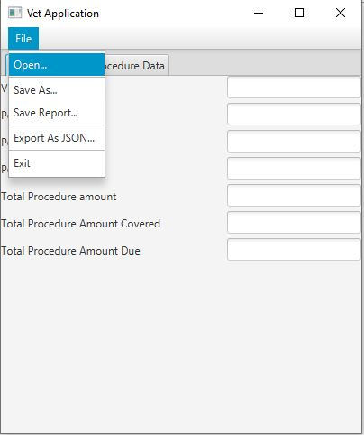

# Veterinarian-Application
This application takes data from manually produced .txt file with veterinarian data and organizes it in a formatted manner. There are 3 menus in total. 

**1. VisitProcedureConsoleUI**
 - Read Visit Procedure from file (use the VisitProcedure.txt file)
- Write Visit Procedure to file (can be any 'FileName'.txt)
- Show visit procedure data with descriptive text on screen
– Show visit procedure JSON on screen
- Exit
  
**2. VisitConsoleUI**

- Read visit info from file (use the Visit.txt file)
- Write visit into file (can be any 'FileName'.txt)
– Show visit procedure by index
– Show visit procedure with highest amount due
- Show visit report on screen
- Show visit as JSON string on screen
- Show visit toString on screen
- Exit
  
**3. VetGraphicalUI**

Graphical UI Tabs: 

  Overview: The Overview tab shows the veterinarian name, pet name, pet species, pet gender, procedure
            amount, procedure amount covered, and procedure amount due.
            
  Visit Procedure Data: The Visit Procedures tab shows all the visit procedure data in a ListView.
  
**Menu with 5 items**

- Open (use the Visit.txt file):
    1. When the user selects the Open menu item the program will display a FileChooser and let the user decide which file to read data from.
        
- Save As (can be any 'FileName'.txt): 
    1. When the user selects the Save As menu item the program will display a FileChooser and let the user decide which file to write data to.
        
- Save Report(can be any 'FileName'.txt):
  1. When the user selects the Save Report menu item the program will display a FileChooser and let the user decide which file to write a report to.
        
- Export As JSON (can be any 'FileName'.txt):
  1. When the user selects the Export As JSON menu item the program will display a FileChooser and let the user decide which file to write the JSON to.
  
- Exit
  1. Exits GUI and brings you back to console menu
  

  
